# PL\0 complier
This project is a toy compiler which compile from PL\0 language to assembly language

[PL/0](https://en.wikipedia.org/wiki/PL/0) is a programming language, intended as an educational programming language, that is similar to but much simpler than Pascal, a general-purpose programming language.

[PL\0](https://en.wikipedia.org/wiki/PL/0) is [LL](https://en.wikipedia.org/wiki/LL_grammar) (1) language which just need to lookahead **1** tokens to decide what to do with the current token.

# Compile and run project 
```
g++ *.cpp -o main || g++ main.cpp -o main
```
## Run project 

``` ./main  <path to code file>```

The compiler will check syntax. If the code does not have the error, PL\0 code will comply to the assembly code

### Example :

``` ./main asm8 ```

PL\0 code is:
```
program asd;
const b = 10;
var x,i,k;
begin 
	i:=0;
	x:=1;
	call readi(k);
	for i:=1 to k do
	begin
		x:=x*i;
	end;
	call writei(x);
end.
```

will be complied become:

```
0    J   1
1    INT   7
2    LA   0,   5
3    LC   0
4    ST
5    LA   0,   4
6    LC   1
7    ST
8    LA   0,   6
9    RI
10    LA   0,   5
11    CV
12    LC   1
13    ST
14    CV
15    LI
16    LV   0,   6
17    LE
18    FJ   31
19    LA   0,   4
20    LV   0,   4
21    LV   0,   5
22    MUL
23    ST
24    CV
25    CV
26    LI
27    LC   1
28    ADD
29    ST
30    J   14
31    DCT   1
32    LV   0,   4
33    WRI
34    BP
35    
```


# Analysis Phase

## Lexical 

 **begin, end, if, then, while, do, call, odd, to
		const, var, procedure, program, else, for**
		
		  
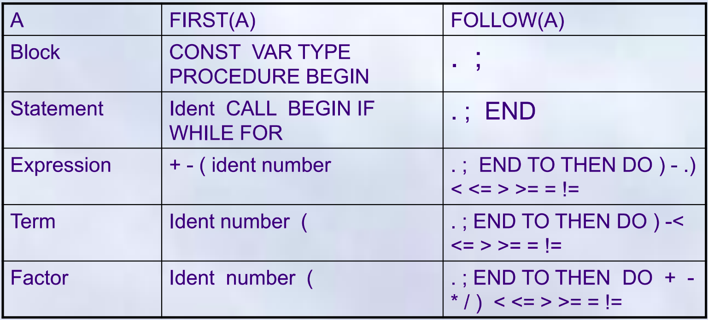


## Syntax
Syntax of PL\0 language

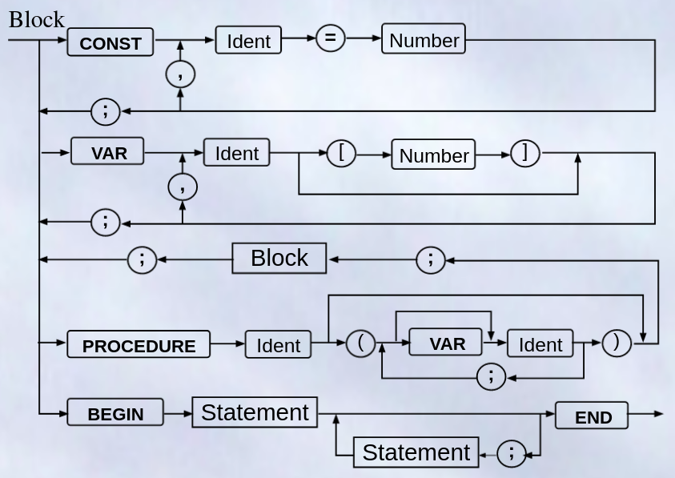
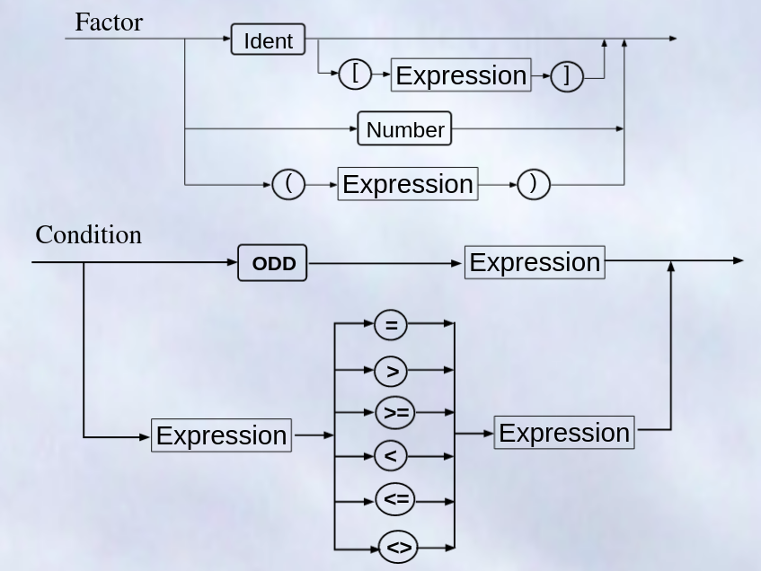
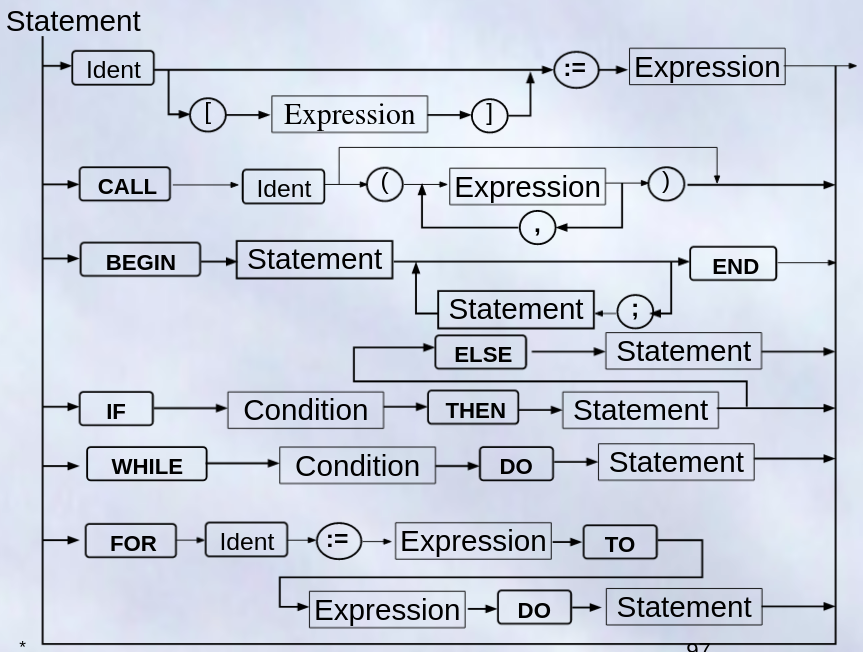
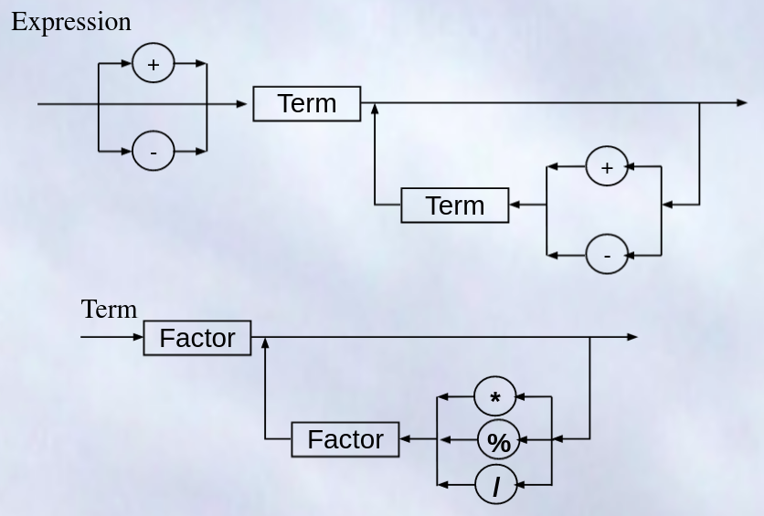

Complie need parse code to each statement.

## Check error

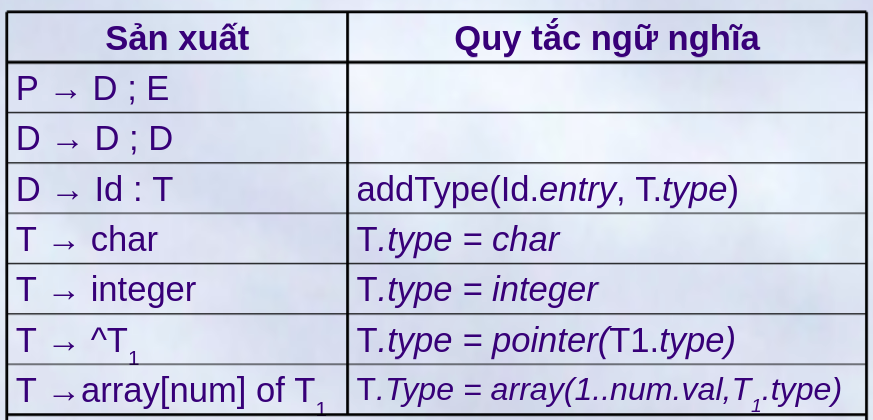
Check error of identical

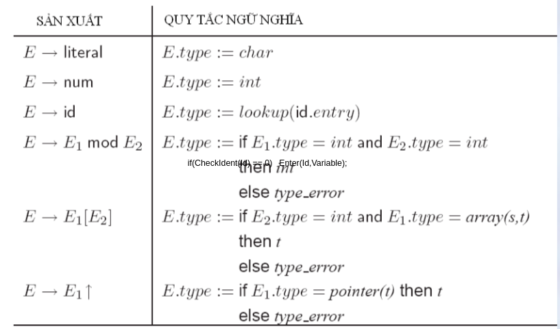
Check error of type of expression

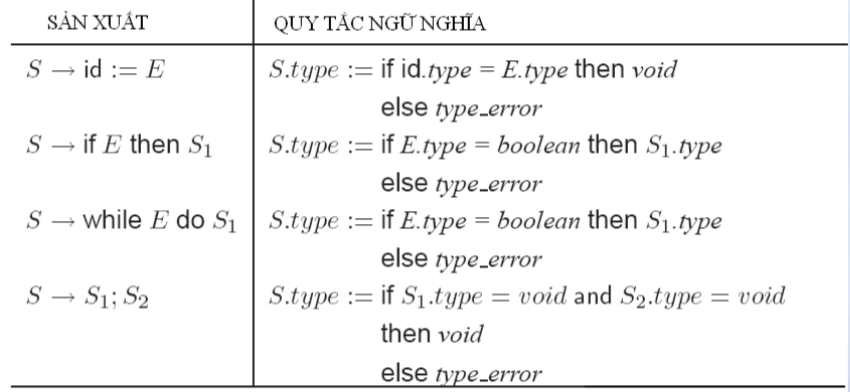
Check error of type of command


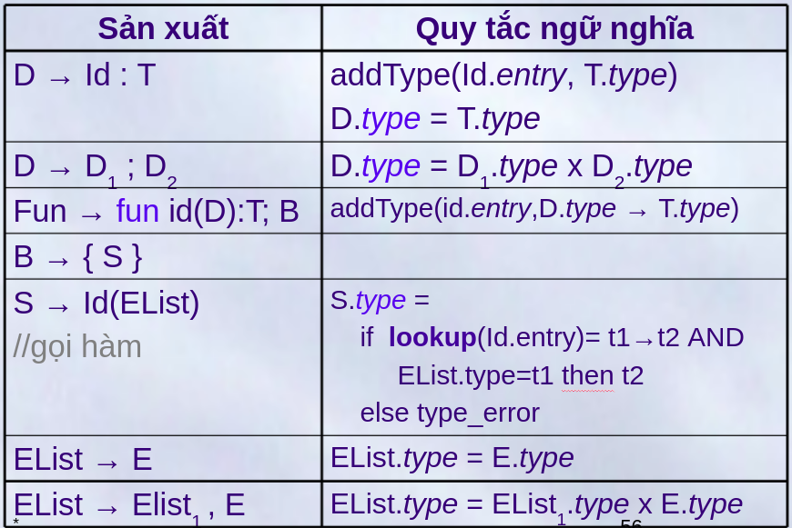
Check error of type of function


## Assembly Code Generator

Use Stack-based CPU Organization

Struct follow by  
``` op + p + q ``` with ```op``` is operator


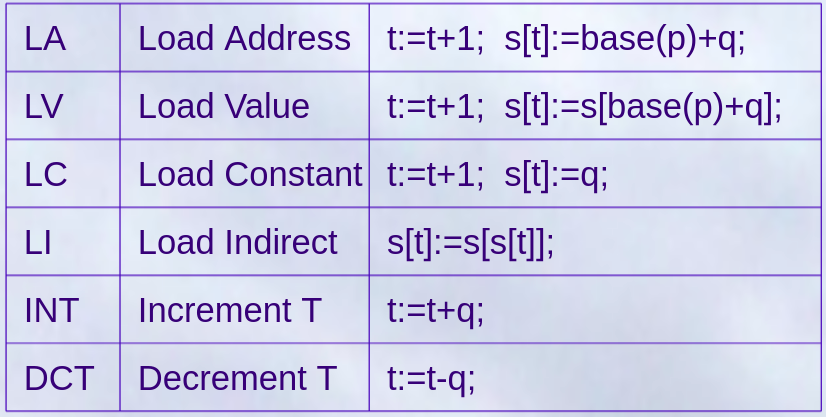
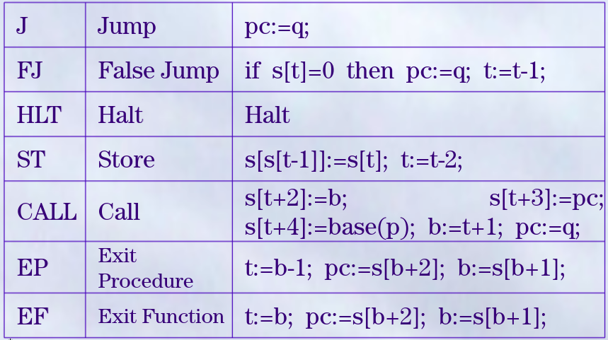
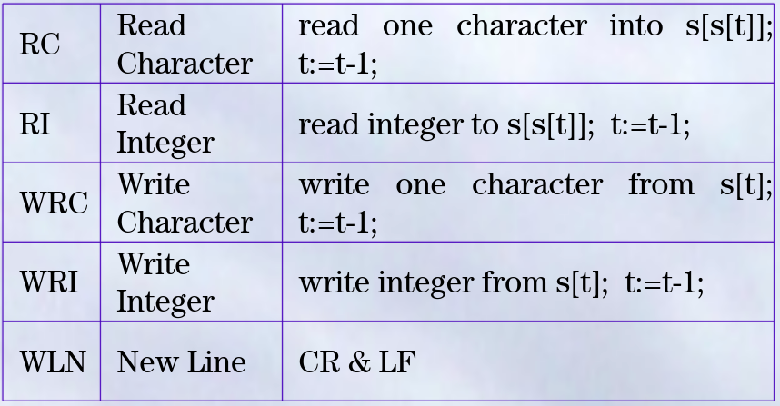
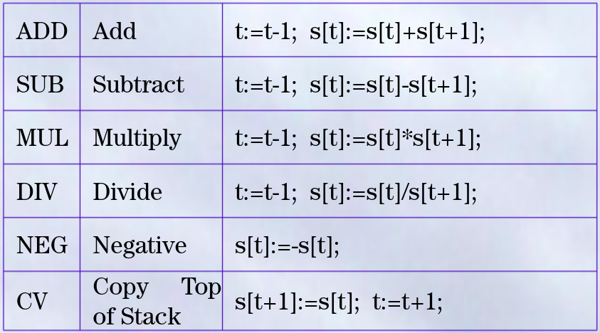
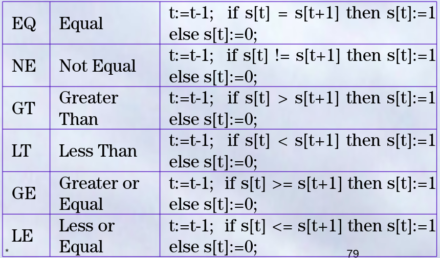


